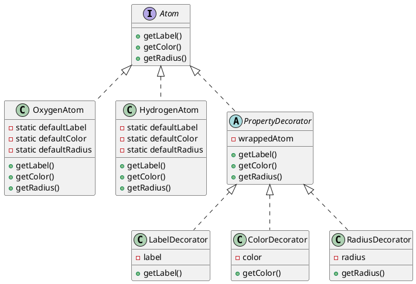

# Atom

```plantuml
@startuml

Interface Atom{
    + getLabel()
    + getColor()
    + getRadius()
}

Class OxygenAtom{
    + getLabel()
    + getColor()
    + getRadius()
    - static defaultLabel
    - static defaultColor
    - static defaultRadius
}

Class HydrogenAtom{
    + getLabel()
    + getColor()
    + getRadius()
    - static defaultLabel
    - static defaultColor
    - static defaultRadius
}

Abstract PropertyDecorator{
    + getLabel()
    + getColor()
    + getRadius()
    - wrappedAtom
}

Class LabelDecorator{
    + getLabel()
    - label
}

Class ColorDecorator{
    + getColor()
    - color
}

Class RadiusDecorator{
    + getRadius()
    - radius
}


Atom <|.. OxygenAtom
Atom <|.. HydrogenAtom

Atom <|.. PropertyDecorator

PropertyDecorator <|.. LabelDecorator
PropertyDecorator <|.. ColorDecorator
PropertyDecorator <|.. RadiusDecorator

@enduml
```

