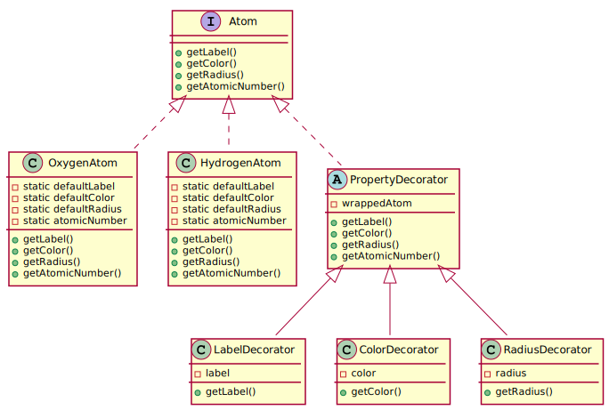
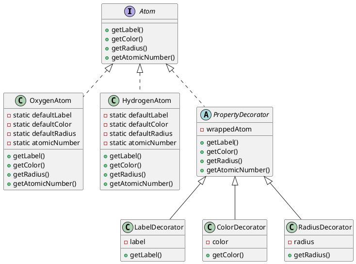

# Atom

```plantuml

@startuml

Interface Atom{
    + getLabel()
    + getColor()
    + getRadius()
    + getAtomicNumber()
}

Class OxygenAtom{
    + getLabel()
    + getColor()
    + getRadius()
    + getAtomicNumber()
    - static defaultLabel
    - static defaultColor
    - static defaultRadius
    - static atomicNumber
}

Class HydrogenAtom{
    + getLabel()
    + getColor()
    + getRadius()
    + getAtomicNumber()
    - static defaultLabel
    - static defaultColor
    - static defaultRadius
    - static atomicNumber
}

Abstract PropertyDecorator{
    + getLabel()
    + getColor()
    + getRadius()
    + getAtomicNumber()
    - wrappedAtom
}

Class LabelDecorator{
    + getLabel()
    - label
}

Class ColorDecorator{
    + getColor()
    - color
}

Class RadiusDecorator{
    + getRadius()
    - radius
}


Atom <|.. OxygenAtom
Atom <|.. HydrogenAtom

Atom <|.. PropertyDecorator

PropertyDecorator <|-- LabelDecorator
PropertyDecorator <|-- ColorDecorator
PropertyDecorator <|-- RadiusDecorator

@enduml
```

